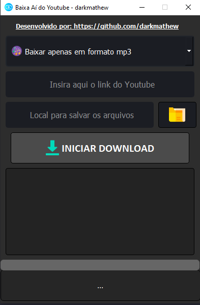
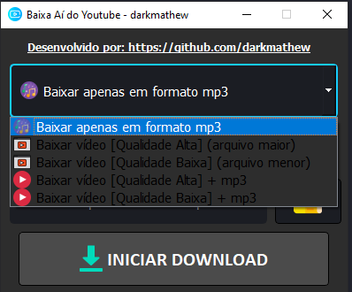
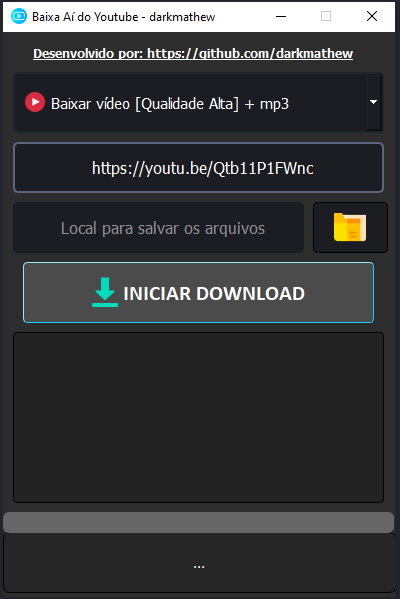
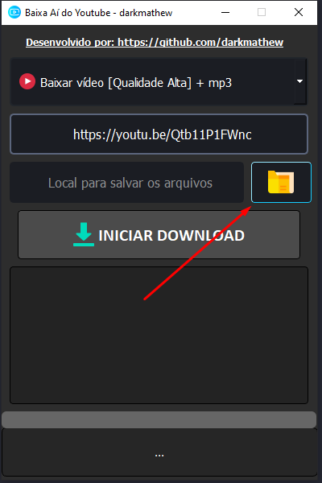
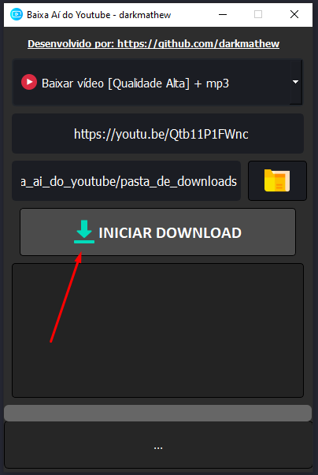
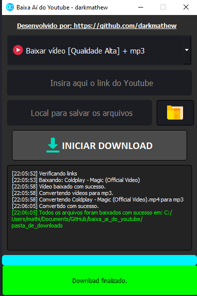

# Baixa Aí do Youtube

## O que ele faz?

Com este programa você consegue baixar o seguinte:
- Vídeo solo
- Playlist de vídeos
- Músicas em mp3
- Vídeos + músicas

## Download

- [(Opção 1) Clique aqui para Baixar](./windows_executable/baixa_ai_do_youtube_option1.rar)
- [(Opção 2) Clique aqui para Baixar](./windows_executable/baixa_ai_do_youtube_option2.rar)

**Obsevação:** Voce precisará ter o [Winrar](https://www.win-rar.com/postdownload.html?&L=9) ou [7zip](https://www.7-zip.org/download.html) para extrair a pasta do programa, e então poder executá-lo.

## Como utilizar?

**Passo 1:** Ao abrir o programa você irá se deparar com a tela abaixo:

**Passo 2:** Escolha a opção de download.

**Passo 3:** Insira o link do Youtube, pode ser tanto de um vídeo qualquer, ou de uma Playlist de vídeos.

**Passo 4:** Selecione a pasta em que voce deseja salvar os arquivos.

**Passo 5:** Clique em iniciar Download, e aguarde o processo iniciar.

**Passo 6:** Pronto, seu download foi concluído com sucesso.

### Quero adicionar coisas novas neste programa, como faço?

O código fonte deste projeto está livre para quaisquer tipos de modificações, desde que você não tenha o intuito de gerar lucros com isto. [Código fonte aqui](./source_code)

### Tecnologias utilizadas

- Python 3.11 (linguagem de programação)
- Biblioteca Pytube (download dos recursos do Youtube)
- Biblioteca PyQt5 (interface gráfica)
- Biblioteca MoviePy (conversão para mp3)

## Créditos

Este programa foi desenvolvido por Matheus Augusto Souza dos Santos, ou se preferir [darkmathew](https://github.com/darkmathew).
